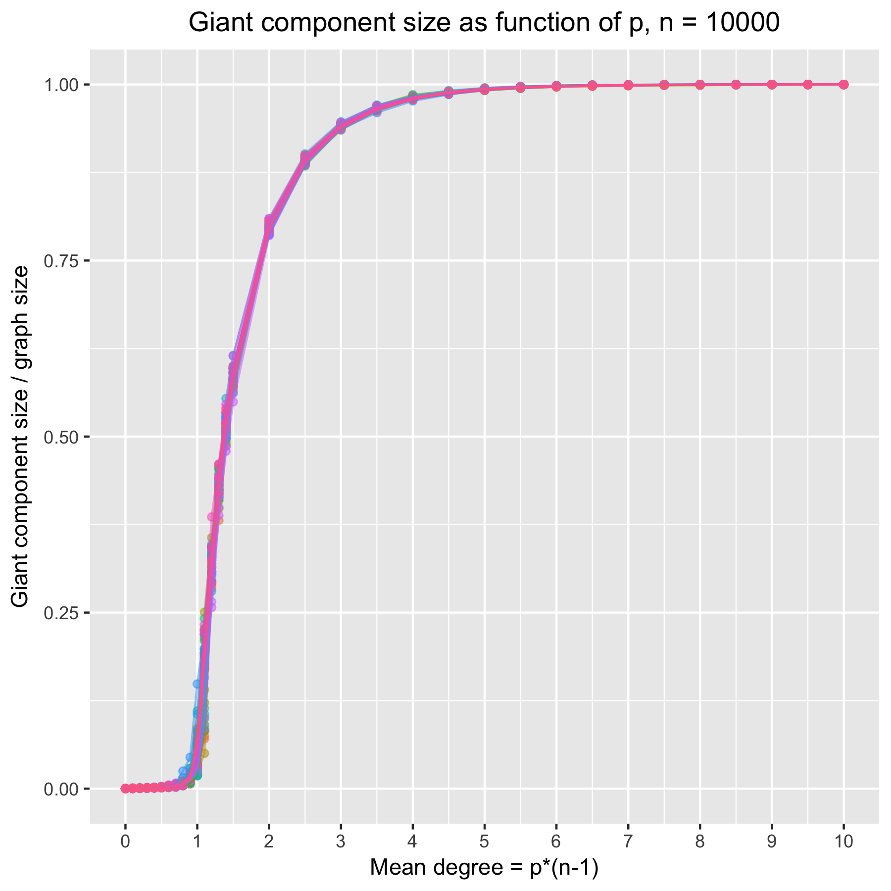
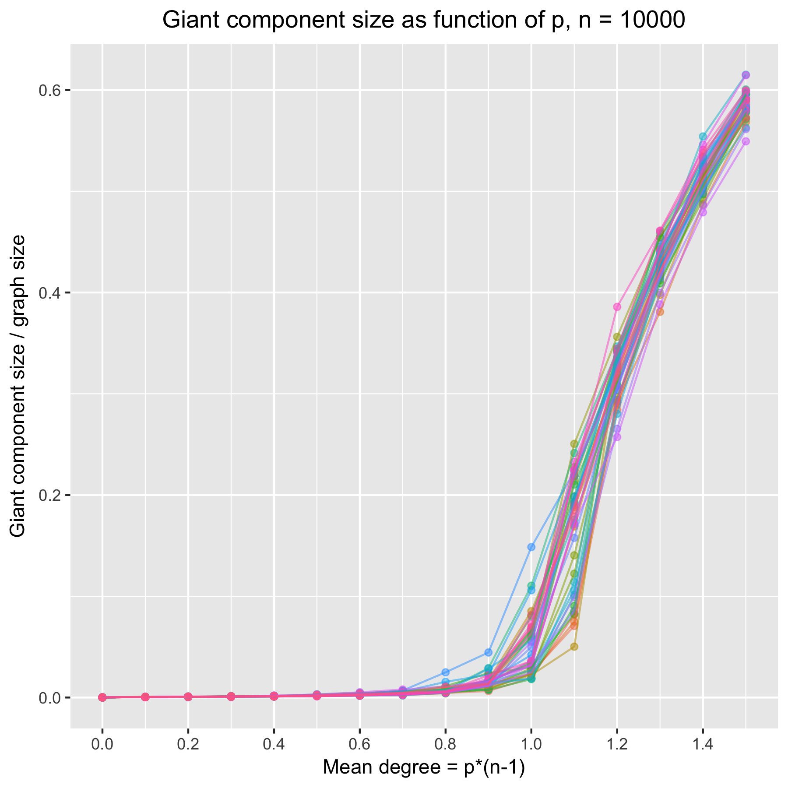
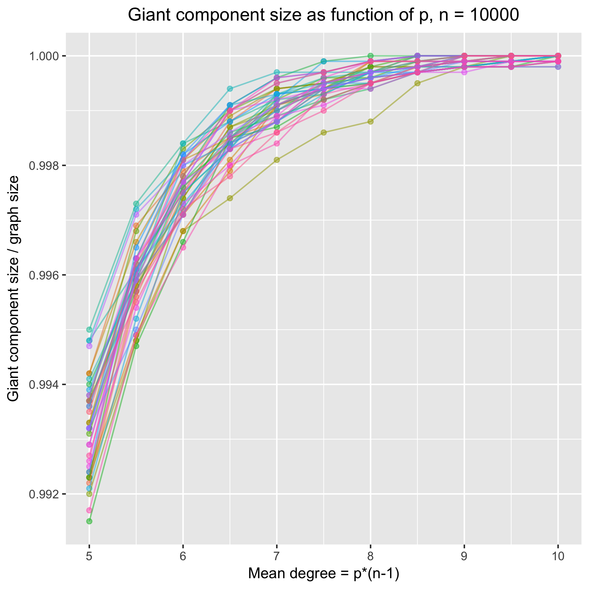

# Giant component demo

## Summary

 

This project explores the size of the largest connected component in the Erdős–Rényi random graph. In this model, abbreviated G(n, p), all the n-choose-2 possible edges are i.i.d. sampled and included with probability p. In their seminal 1959 paper, Erdős and Rényi characterized the sharp emergence of a "giant component" when enough edges are added, which in the case of G(n, p) occurs when p > 1/n.

The C++ file `giant.cpp` simulates G(n, p) random graphs and calculates their giant component sizes, and the R script `make_figures.R` plots the results.

## Running

Once the repository is cloned, the figures above can be reproduced as follows:

    make giant
    ./giant.sh 10000

To reproduce the other figures in the `static/` directory, one will likely need to run for several hours for the largest case. The commands are:

    ./giant.sh 50
    ./giant.sh 500
    ./giant.sh 1000000
